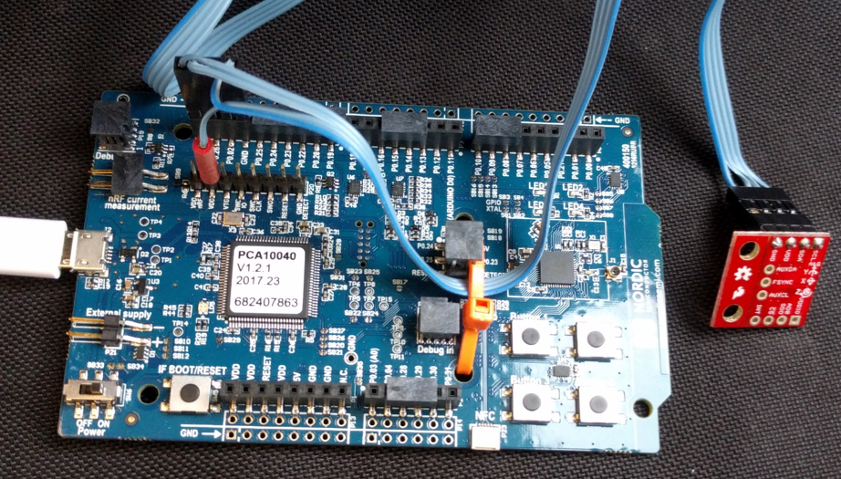
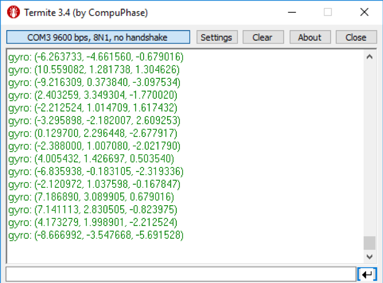
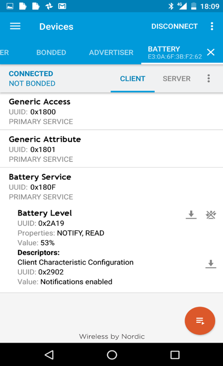

## PDIoT Coursework Notes

# Introduction

The coursework for Principles and Design of IoT systems: from Devices to Data Analytics (PDIoT) complements the accompanying lectures by implementing an end-to-end IoT system: from a wearable application idea to a working prototype. You are given an inertial sensor, embedded development board and a mobile phone, and your task is to realise the wearable application as a working prototype, including developing the mobile application to interface wirelessly with the inertial sensor to stream data, implement data analytics and visualise the effects on the phone. o interface with an inertial sensor. 

The rest of this document is split into sections corresponding to each part of the practical and provides setup instructions and suggested first steps.

# Git Repository

A list of supporting files are available from the following GitHub [repository](https://github.com/specknet/pdiot-practical). In case the orient-android app is missing after cloning visit this [repository](https://github.com/JohnBruckner/orient-android-finland)

You are encouraged to use version control for your own work. A short tutorial on Git and Github can be found [here](https://www.freecodecamp.org/news/what-is-git-and-how-to-use-it-c341b049ae61/).

Start by cloning this repository:
1. Open the terminal app.
2. Navigate to the folder where you wish to have the files using the terminal.
3. Run ```git clone https://github.com/specknet/pdiot-practical.git``` to get the repo.
4. Type ```git submodule init``` and ```git submodule update``` to download the Android app as well.
4. Now all the files can be found in the "pdiot-practical" folder.

Alternatively you can download the files in the following way:
1. Go to the link above. 
2. Click the "Clone or Download" button. 
3. Select the "Download as ZIP.
4. Save and unarchive the file.
5. On the Github page click on "orient-android", which will take you to the code for the Android app.
6. Once on the "orient-android" page proceed similarly and download the files as zip.
7. Unarchive the files inside the "pdiot-practical" folder.
8. You should now have all the required files in their place.

# Data Analysis

## 1. If you don't already have it then Install conda
1. **Check you don't already have conda installed!**
    1. `which conda`
    1. **if you already have it installed, skip ahead to Create an Environment**
    1. It doesn't matter if you have miniconda3, or anaconda3 installed (it does not even matter if it is version 2).
1. If you don't have conda, download the latest version of miniconda3
    1. `cd ~/Downloads` (you can make a Downloads folder if you don't have one)
    1. Download the installer (we prefer to use miniconda since it carries less baggage), depending on your system (you can check links [here](https://conda.io/miniconda.html)):
        * Linux: `wget https://repo.continuum.io/miniconda/Miniconda3-latest-Linux-x86_64.sh`
        * Mac: `wget https://repo.continuum.io/miniconda/Miniconda3-latest-MacOSX-x86_64.sh` or ```curl -LOk https://repo.continuum.io/miniconda/Miniconda3-latest-MacOSX-x86_64.sh```
        * Or just simply download from [the site](https://conda.io/miniconda.html)
1. Install miniconda3 *with default settings*
    1. `bash Miniconda3-latest-Linux-x86_64.sh`
    1. Follow the prompt - **type `yes` and hit `enter` to accept all default
    settings when asked**
1. Close Terminal and reopen
1. Try executing `conda -h`. If it works, you can delete the installer
```rm ~/Downloads/Miniconda3-latest-Linux-x86_64.sh```

## 2a. Create an environment for PDIoT
1. Update conda: `conda update conda`
1. Create the environment for the course. Call it py3iaml and install python 3 (*hence the name*):
```conda create -n py2pdiot python=3.7```

## 2b. Err...what's an environment?
An environment is a collection of packages of specific versions. You can have
multiple environments and switch between them for different projects. Conda is
a tool for managing both environments *and* the packages within each
environment. Here's a quick intro:

1. Show a list of your environments: `conda env list`
1. Print `$PATH`, one of your system's [environment variables](https://en.wikipedia.org/wiki/Environment_variable), in the
terminal: `echo $PATH`
    * `$PATH` is the list of directories your terminal can search to find
anything you execute:
1. Print a list of python installations on your `$PATH` (the top one is the one
    that will get executed if you type `python` in the terminal):
    `which python -a`
1. Activate the new environment: `source activate py3pdiot`
1. Show list of python installations on your system *now*: `which python -a`
1. Show your system `$PATH` again: `echo $PATH`
1. Deactivate the new environment: `source deactivate`
1. Observer how your $PATH has changed again: `echo $PATH`
1. Make an empty environment: `conda create --name empty`
1. You can clone environments; this is useful for backing up: `conda create
--name empty_bkp --clone empty`
1. Make another python 3 environment with numpy already installed: `conda create
--name py3 python=3.7 numpy`
1. `conda env list`
1. Activate py3: `source activate py3`
1. Show the installed packages: `conda list`
1. Switch environments: `source deactivate; source activate empty`
1. `conda list` to show packages (note that python and, crucially,
    [pip](https://pip.pypa.io/en/stable/) are not installed)
1. Q: What python would get used now? `which python` A: the conda root
environment installation of python i.e. *not* this environment's python.
1. Install numpy: `conda install numpy`
1. Q: What python would get used *now*? `which python` A: You may have clocked
that conda installed a dependency of numpy (a python package)...python!
1. Let's delete these test environments:
    * `source deactivate`
    * `conda env list`
    * `conda remove --name empty --all`
    * `conda remove --name empty_bkp --all`
    * `conda remove --name py3 --all`
    * `conda env list`

## 3. Recommended setup
* Conda environment with python 3.7
* Jupyter notebooks + [Numpy](https://docs.scipy.org/doc/numpy-1.17.0/numpy-user-1.17.0.pdf) + [Pandas](https://pandas.pydata.org/pandas-docs/stable/getting_started/10min.html) + [Matplotlib](https://matplotlib.org/tutorials/introductory/pyplot.html#sphx-glr-tutorials-introductory-pyplot-py)


## 4. Task - Develop the step-tracking algorithm
We recommend that you develop the step tracking algorithms using existing walking data and running them offline on a PC. Once you are happy with your algorithm, it can be ported to your Android app to perform steptracking on live sensor data.

Python and Jupyter Notebook are tools for rapid analysis of the sensor data. Further information for this section is contained in the accompanying Jupyter notebook.


# Android

The practical will require you to develop an Android app, which will interface to your wireless sensor (called the Cube) using Bluetooth LE and provide a user interface showing the step count. You will also be provided with a basic app which can be used to record sensor data for offline analysis.

## 1. If you don't already have it - Install Android Studio

It is recommended that you use Android Studio. The IDE can be downloaded from [here](https://developer.android.com/studio/).

## 2. Phone

We use Xiomi Redmi 4A or 5A phones and can lend one if required. Other phones may work for the practical but there can be Bluetooth compatibility issues with other devices.

## 3. Data Collection App

The repo contains the source code for an application that can record accelerometer and gyroscope data and record them in a CSV file. Please use this to collect walking data to ensure that all groups use a common file format and include appropriate metadata.

## 4. BLE Introduction

Bluetooth Low Energy (BLE) provides wireless communications for low power devices. Devices advertise one or more services, which themselves contain a number of characteristics. For example, a heart rate monitor may provide a service which contains a characteristic which will send the current pulse rate. Characteristics can either be readable, writable or allow notifications, which means that new data will be streamed over BLE when it is available. This is the mode that we use to send accelerometer and gyroscope data from the Cube.

The Nordic Semiconductor NRF Connect app (available on play/app store) will allow you to connect to BLE devices and interrogate the services and characteristics that they provide. It can also send/receive data and log communications to a file, which can be useful for debugging. Try this with the Cube to see how the sensor data is sent over BLE. Gyroscope, accelerometer and magnetometer data are packed into an 18-byte packet, where each axis of each sensor requires 2 bytes to send a 16-bit value.

## 5. Nordic Thingy52 (Cube)
You will be provided with a Nordic [Thingy52](http://www.nordicsemi.com/thingy) IoT sensor kit which can be used to learn about motion sensors and to collect walking data. There is a supporting [Android app](https://play.google.com/store/apps/details?id=no.nordicsemi.android.nrfthingy&hl=en_US) available.

Details on the architecture of the system, the characteristics for different services and the packet structure can be found [here](https://nordicsemiconductor.github.io/Nordic-Thingy52-FW/documentation/firmware_architecture.html).

## 6. BLE on Android

As mentioned previously, the repository contains the PDIoT data collection app, which you can use as an example of BLE communication on Android. We use the RXAndroidBLE library which simplifies much of the communication code. Note that this requires Java 8 support (enabled in build.gradle as shown below).

[https://polidea.github.io/RxAndroidBle](https://polidea.github.io/RxAndroidBle)

build gradle:

```java
android {
        compileOptions {
            sourceCompatibility JavaVersion.VERSION_1_8
            targetCompatibility JavaVersion.VERSION_1_8
            }
}
```

## 7. Permissions

To make the data collection app work correctly, you&#39;ll need to enable _location_ and _storage_ permissions in _settings/apps/permissions_. Location permissions is required when scanning for BLE devices. If you don&#39;t have this you&#39;ll see a _BLE Scanning Error_ message when starting the app.

## 8. Testing the development environment and collecting data

In order to test that the environment has been set up properly, we will install the app on the phone and test to see if it receives data from the Cube.

1. Open Android Studio
2. Open the orient-android project which has been downloaded along with the rest of the files
3. Navigate to "app/src/main/java/com/specknet/orientandroid" and open the "MainActivity.java" file.
4. At the top of the file you will find three variables (ORIENT_BLE_ADDRESS, ORIENT_QUAT_CHARACTERISTIC, ORIENT_RAW_CHARACTERISTIC) whose values have to be filled in by you. Note: ORIENT_BLE_ADDRESS refers to the MAC Address of the cube.
5. Connect the phone to the computer using a USB cable.
6. Press on the "Run App" button, which can be found in the top right-hand part of the Android Studio interface. This will compile the code and install the app on the phone.
7. Unlock the phone and open the app. It should automatically connect to your Cube and start displaying data.

## 9. Accessing the data
The data is saved directly to the storage of the phone.
To access it:

1. Connect the phone to your computer.
2. On the phone there should appear a popup/notification indicating that it has connected.
3. Tap on the notification, this will present you with three options: Charge this device; Transfer files, Transfer photos (PTP).
4. Select the Transfer files option.
5. In your file browser you should now be able to find the phone and browse the files.

## 9. Task description

Your task is to extend the current application in the following way: 
* Implement a step tracking algorithm 
* Design a UI for the app to display the current step count


# Embedded Development

## Introduction

This section concerns embedded systems development using the MBed embedded development platform. You will use this to receive sensor data and later to run your own step tracking algorithms.

Test firmware has been provided for you with the following functionality:

- Flashes an LED on the dev board
- Sends debugging information to the PC over serial
- Communicates with the Inertial Measurement Unit (IMU) breakout board
- Streams sensor data over Bluetooth Low Energy (BLE)

It is important to reproduce this behaviour before starting to modify the code running on the dev board, as it will rule out basic problems early on.

## NRF52-DK

You have been provided with a Nordic NRF52-DK board, which should be set up as follows:

### Updating the bootloader

1. Locate the **0246\_sam3u2c\_mkit\_dk\_dongle\_nrf5x\_0x5000.bin** bootloader image. It should be under "pdiot-practical/NRF25-DK".
2. Switch off the dev board.
3. Connect to your PC via USB.
4. Whilst holding down the rest button, turn on the dev board.
5. It should appear as a mass storage device.
6. Copy the bootloader image to the MSD.
7. Turn the board off and on again.
8. It should now be in a state where you can flash a program file.

### Flashing the board

First make sure that you can run a basic program on the dev board. You can always return to this example later to verify that your board is still working. The following firmware .hex files are available from the following GitHub repository:

1. Locate the **BLE\_LED\_NRF52\_DK.hex** firmware image. It should be under "pdiot-practical/NRF25-DK".
2. Switch on the dev board and connect it to your PC via USB. It should appear as a mass storage device.
3. Copy the firmware to the mass storage device.
4. Turn the board off and on again to run the program.
5. LED1 on the dev board should start to flash once per second.

If this example fails to run you may need to reflash the bootloader on your dev board, as described above.

## MPU-9250

The InvenSense MPU-9250 is an IMU motion tracking board containing a 3-axis accelerometer, gyroscope and magnetometer. These sensors can be used together to provide full 3D motion tracking.

### Wiring

You have been provided with an MPU-9250, which is mounted on a Sparkfun breakout board. This can be connected to the dev board using the I2C interface. You should make the following connections using jumper cables:

| **Connection** | **Dev board** | **MPU breakout board** |
| --- | --- | --- |
| Power | VDD | VDD |
| Ground | GND | GND |
| I2C Clock | P0.27 | SCL |
| I2C Data | P0.26 | SDA |

 

>Figure 1: Connecting the MPU breakout board to the NRF52-DK

### Testing communication

The provided **I2C\_HelloWorld\_Mbed\_NRF52\_DK.hex** program tests communication between the NRF52-DK and the PC (via USB-serial port) and the MPU-9250 (via I2C). Run the app by copying the file on the board and then turning it off and on again.

<!-- 1. Connect the dev board to the PC via USB and switch on.
2. Using a terminal application, open a connection to the J-Link CDC serial port using the following settings:
  1. Baud rate: 9600
  2. 8 bits
  3. Stop bits: 1
3. Copy the above .hex file to the NRF52-DK mass storage device.
4. The program should now run and display gyro output from the MPU. The values should be close to zero when static and increase when you rotate the sensor. -->

Now we need to establish a serial connection to the board to test it working. The following [guide](https://learn.sparkfun.com/tutorials/terminal-basics/command-line-windows-mac-linux) provides instructions on how to do so on both Unix and Windows machines. Note: the device should look like this "tty.usbmodem14202", if this doesn't work, try "cu._device-name_".

 

>Figure 2: Expected serial output when testing MPU comms

### Testing BLE communication

We recommend using the Nordic nRF Connect app for BLE debugging. This allows you to see the services provided by your BLE device, stream data from notifications and log it to a file. [https://www.nordicsemi.com/eng/Products/Nordic-mobile-Apps/nRF-Connect-for-mobile-previously-called-nRF-Master-Control-Panel](https://www.nordicsemi.com/eng/Products/Nordic-mobile-Apps/nRF-Connect-for-mobile-previously-called-nRF-Master-Control-Panel)

Try loading the supplied **mbed-os-example-ble-BatteryLevel\_NRF52\_DK.hex** BLE example. This will send fake battery level values, for testing the Bluetooth communication.

1. Copy the .hex firmware image to your dev board as described earlier.
2. The dev board should now be discoverable over BLE, with the name &quot;BATTERY&quot;.
3. Open _nRF Connect_ on your phone and scan for devices.
4. Press the _connect_ button for the &quot;BATTERY&quot; device.
5. Expand the _Battery Service_ and click the multiple down arrow icon next to _Battery Level_ to stream battery percentage notifications.


 Device List             |  Device details
:-------------------------:|:-------------------------:
  |  
 
 

## Mbed development platform

We will use the mbed development platform to compile firmware to run on the NEF52-DK board, which is fully supported in mbed OS 5. See the handbook for more information: [https://docs.mbed.com/docs/mbed-os-handbook/en/latest/](https://docs.mbed.com/docs/mbed-os-handbook/en/latest/)

### Online compiler

We recommend that you use the [mbed online IDE and compiler](https://ide.mbed.com/compiler/) for your firmware development. In order to use this tool you first need to create an account.

Once you&#39;ve registered for an account and set your hardware to the NRF52-DK you&#39;ll have access to your own workspace. This will allow you to compile code and download the resulting firmware image to copy to the dev board. There is also an in-built version control system for you to use for your mbed projects.

A quick guide on how to use this tool can be found [here](https://os.mbed.com/docs/mbed-os/v5.13/quick-start/online-with-the-online-compiler.html).

### Example code

The OS5 mbed-os-exanple projects are a good starting point for your own firmware.

[https://os.mbed.com/teams/mbed-os-examples/code/](https://os.mbed.com/teams/mbed-os-examples/code/)

We recommend starting with the blinky example, which flashes LED1 as seen in the first test program above.

[https://os.mbed.com/teams/mbed-os-examples/code/mbed-os-example-blinky/](https://os.mbed.com/teams/mbed-os-examples/code/mbed-os-example-blinky/)

Here are two further examples that include Bluetooth functionality:

https://os.mbed.com/teams/Bluetooth-Low-Energy/code/BLE_GATT_Example/
https://os.mbed.com/teams/mbed-os-examples/code/mbed-os-example-ble-Button/

You can use the _Import into compiler_ button to import the project into your own workspace in the mbed online compiler. Now try to compile and run the blinky example on your board.

### Local toolchain

Although it is possible to set up an embedded toolchain on your local machine, this can be tricky. You are free to attempt this at your own risk, but we won&#39;t be providing any support!

### Libraries

There are several mbed libraries for communicating with the MPU-9250, which are available from the online compiler. The test firmware uses this one: [https://developer.mbed.org/teams/Edutech/code/MPU9250/](https://developer.mbed.org/teams/Edutech/code/MPU9250/)

### Debugging

There are several methods of debugging that you may find useful:

- LEDs – 4 of these can be switched on and off and is probably the simplest way to view output from your code
- Buttons – There are 4 buttons on the mbed board that you can set to perform actions in your firmware
- Serial output – As tested in the above example, it provides more detailed output when connected to a PC
- BLE – More likely to be used for the final output of your firmware, but you can also send values for debugging
- If everything seems broken, please check the coin cell battery voltage on the board!

### Mbed bugs

Mbed is not perfect and you may experience compile errors or other bugs. Please share these and any solutions. Often rolling back the mbed-os library to the previous version using the _Revisions_ option in the online compiler will fix build errors.

# Troubleshooting

